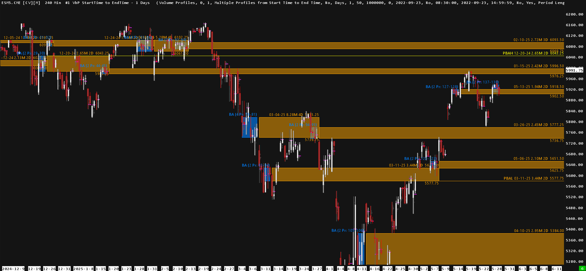
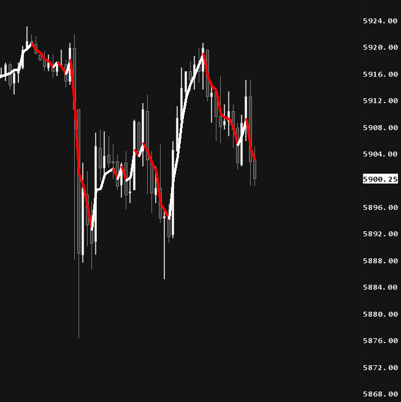
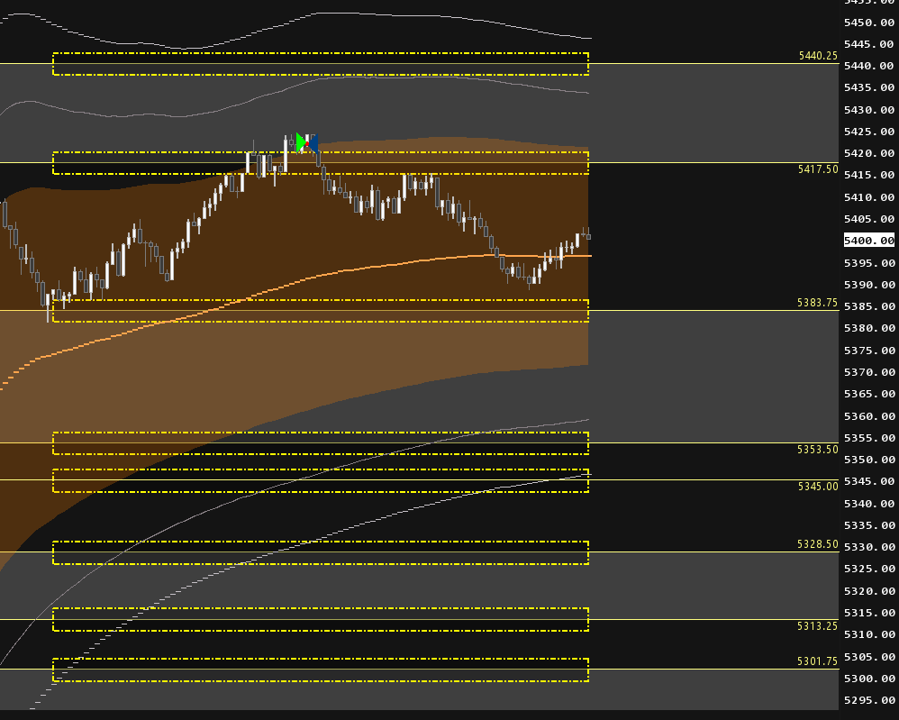

# Sierra Chart Studies
A collection of my custom Sierra Chart studies.

## Table of Contents
- [Installation](#installation)
- [AutoBAs - Automated Balance Area Detection](#autobas---automated-balance-area-detection)
- [M - Momentum Indicator](#m---momentum-indicator)
- [Strike Zone Hotkey System](#strike-zone-hotkey-system)

---

## Installation
Place the `.cpp` file in `ACS_Source` folder, then go to **Analysis → Build Custom Studies DLL → Build → Remote Build - Standard.** Then **Analysis → Studies → Add Custom Study**

---

## AutoBAs - Automated Trading Levels

*AutoBAs identifying balance areas with value area highlights and activation tracking*

AutoBAs identifies and tracks Balance Areas in real-time using volume profile overlap, value area overlap, and geometric proximity analysis. The study monitors BA formation, activation when price breaks value area boundaries, and intersection dynamics between multiple balance areas.

Balance areas become "activated" on breakouts and draw extending rectangles until they intersect with newer activated areas. This creates a hierarchy where older areas are "cut" by newer ones, generating Post-Balance Area Lines (PBALs) as reference levels.

The study includes statistical normality filtering, composite pattern detection (HLH/LHL formations), and probe line identification. It requires a Volume by Price study and supports up to 500 trading sessions with configurable visual styling and debug modes.

---

## M - Momentum Indicator

*M indicator showing momentum analysis with automatic color coding*

M is a momentum oscillator that applies Hodrick-Prescott filtering combined with harmonic analysis to price data. The indicator uses spectral analysis to decompose price movements and extract momentum signals from up to 20 harmonic frequency components.

The process begins with HP filtering to separate trend and cyclical components, then iteratively fits sinusoidal components using least squares regression. The final momentum line combines trend and reconstructed harmonic components with automatic color coding based on slope direction.

The study processes a configurable number of recent bars (default 500) and displays as an overlay in the main chart region. Parameters include smoothing lambda values and harmonic component counts.

---

## Strike Zone Hotkey System

*Strike zones created around predefined price levels using keyboard shortcuts*

The Strike Zone Hotkey System creates temporary rectangular zones around hardcoded price levels using keyboard shortcuts (1, 2, 3, 4). Three zone configurations are available with different distances and heights, each with configurable colors and transparency.

The system monitors keyboard input continuously and creates zones across recent bars when triggered. Zones automatically clear at session end or can be manually cleared. Key repeat protection prevents accidental multiple creation.

Zone parameters include distance from price level, zone height, visual styling, and hotkey assignments. The study uses predefined price levels embedded in the code for specific trading setups.
